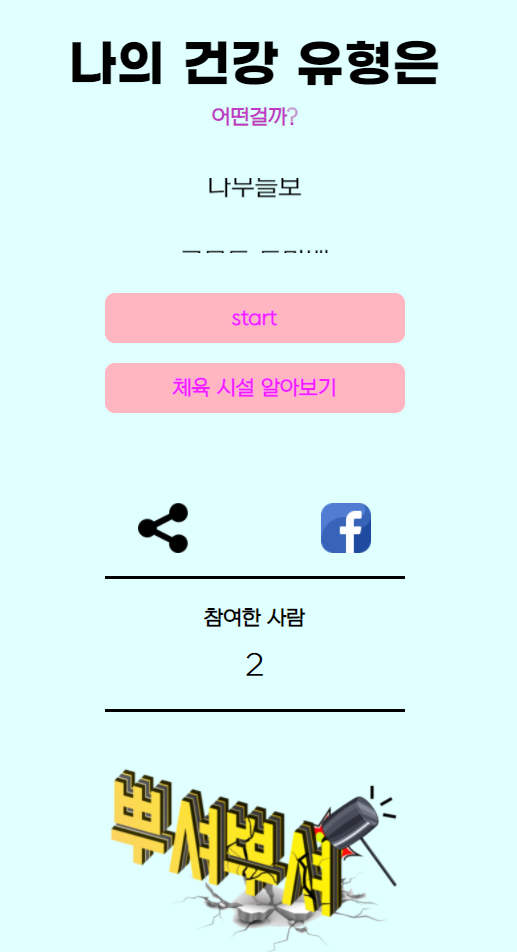
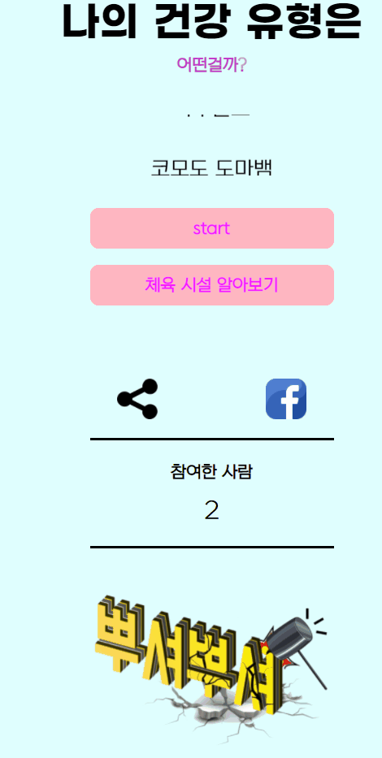
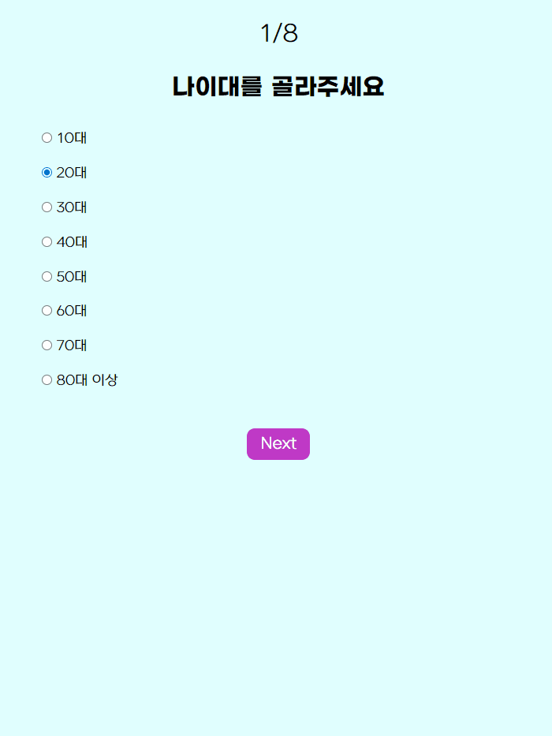
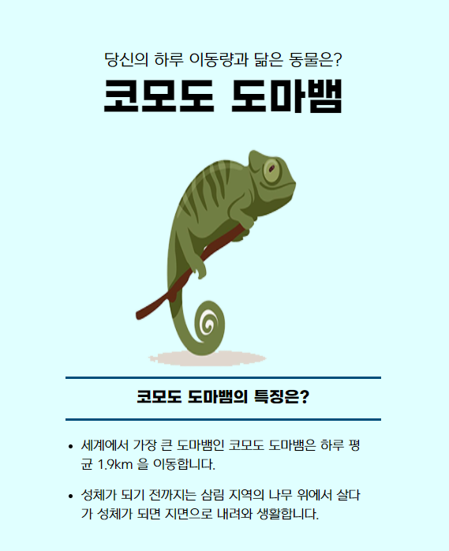
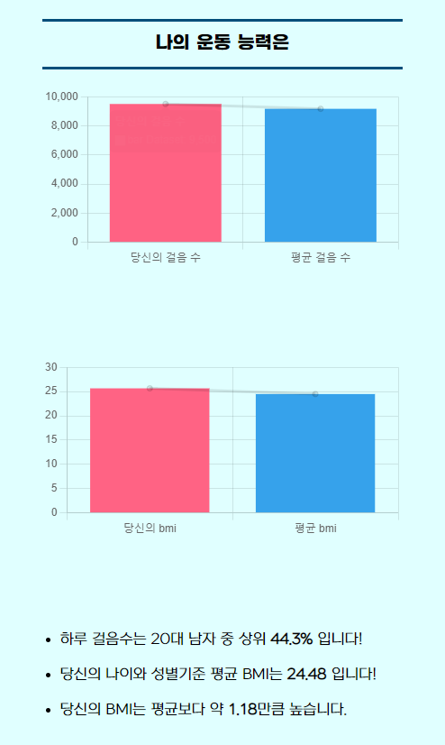
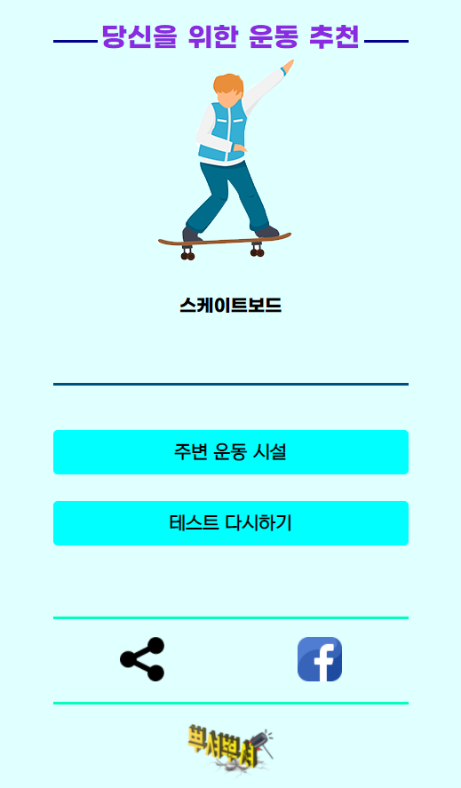
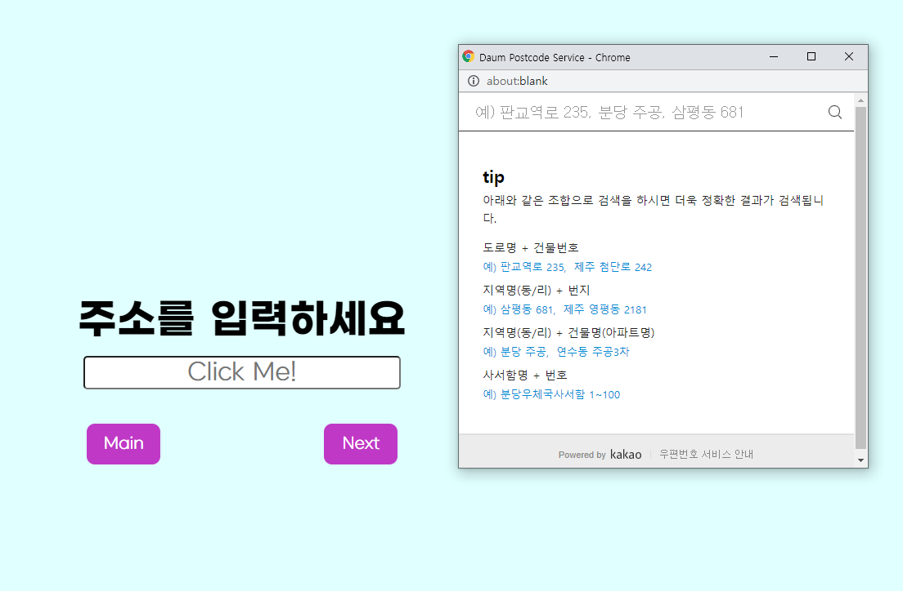
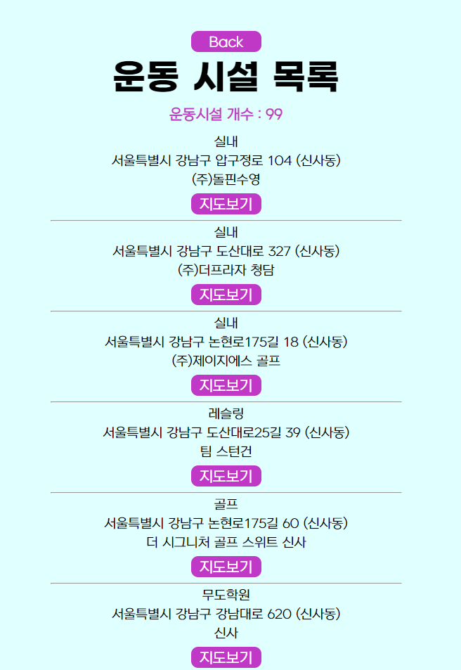
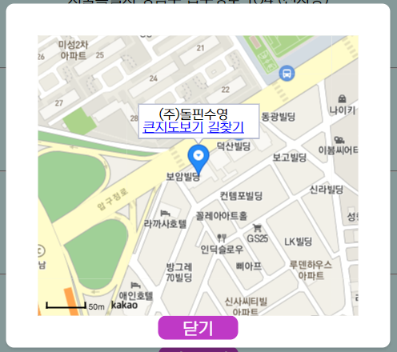

# PPUSYEO TEST

>  건강 관리에 대한 인식 개선과 운동에 대한 접근성을 높이기 위한 테스트 서비스

### 프로젝트 목적

> 테스트 질문을  통해 얻은 테스터의 BMI 및 운동 능력에 대해, 기존에  제공 받은 데이터 셋을 활용하여 사용자에 대한 데이터 분석 및 시각화를 제공하는 웹 서비스 제공, 사용자 위치를 기반으로 주변 운동시설 및 설문 데이터를 바탕으로 운동 추천

#### I. 나의 역할

- BE (Django)
  - 분석된 데이터를 이용하여 DB (MySQL) 구축
  - 전체 url 경로와 그에 따른 view 함수 제작
  - 설문 데이터를 받아 알고리즘을 활용해 사용자의 건강 데이터를 Template으로 전달
  - 결과창에서 보여줄 운동추천과 걸음수 기반 어울리는 동물 추천 알고리즘 제작
  - 사용자에게 주소를 받아 주변의 운동시설을 찾아주고 카카오 MAP API 를 활용한 길찾기 기능 구현

#### II. 목표 서비스 구현

- 사용자의 설문을 바탕으로 어울리는 동물 추천
- 사용자의 설문을 바탕으로 어울리는 운동 추천
- 사용자의 설문을 바탕으로 성별과 나이를 고려한 자신의 걸음수와 BMI 지수를 시각화 된 차트로 표현
- 사용자 입력 주소를 바탕으로 주변의 운동시설 위치 제공

#### III. 필수 기능에 대한 설명

> 메인 페이지

- 설문으로 가는 Start 와 체육시설을 알아보는 버튼을 각각 구현하여 사용자가 원하는 위치로 이동할 수 있도록 구현하였습니다.
- 링크를 복사하거나 facebook 으로 링크를 공유할 수 있도록 하였습니다.

> 설문 페이지

- 설문 페이지를 구현하여 사용자의 설문 내용을 입력 받을 수 있도록 구현하였습니다.

> 결과 페이지

- 사용자 설문의 걸음수와 성별, 나이를 고려하여 사용자의 걸음수 상위 몇 프로인지에 따라 어울리는 동물을 보여줍니다.
- 간단한 동물의 설명을 함께 보여주어 재미와 흥미를 유발하고자 하였습니다.

- 사용자의 걸음 수와 BMI 지수를 그래프와 설명을 통해 결과를 화면에 표현하였습니다.

- 사용자의 설문 결과를 바탕으로 어울리는 운동을 추천해줍니다.
- 주변 운동 시설과 다시 설문을 할 수 있는 버튼을 구현하여 이동할 수 있도록 구현하였습니다.
- 메인페이지와 마찬가지로 현재 화면을 공유할 수 있도록 구현하였습니다.

> 주변 운동 시설 페이지

- 다음 도로명 주소 API 를 이용하여 사용자의 주소를 입력하도록 하였습니다.

- 주소를 입력하고 NEXT 를 누르면 주변 운동시설을 목록으로 제공합니다.

- 지도보기를 누르면 해당 운동시설의 위치를 모달창으로 제공하고, 큰지도보기와 길찾기를 누르면 카카오 MAP API 를 활용해 해당 서비스를 이용할 수 있도록 구현하였습니다.

#### IV. 배포 서버 URL

- [https://ppusyeo.herokuapp.com/](https://ppusyeo.herokuapp.com/)

#### V. 느낀점

> 데이터를 활용하는 BE

백엔드를 담당하였지만, 빅데이터를 활용한 대용량의 데이터를 효율적으로 전달하기 위한 고민을 꾸준히 하였습니다. 이는 특히 알고리즘을 통해 건강 데이터의 상위 퍼센테이지를 계산하고, 조건에 맞는 데이터만을 추출하는 과정에서 최대한 빠르게 계산을 하기 위한 알고리즘을 구축하려 노력하였습니다.

> Frontend도 다룰 줄 아는 Backend 개발자

이번 프로젝트를 통해 가장 크게 얻은 것은 이제 어떤 API 라도 문서가 주어진다면 손쉽게 사용할 수 있는 이해력을 길렀습니다. 카카오 MAP API를 사용할 때 많은 어려움을 겪었고, 주변 운동 시설을 찾는 알고리즘을 작성한 후에 데이터의 구조를 정확하게 알고 있는 사람은 본인이였습니다. 그래서 제가 책임을 지고 카카오 맵 API 를 활용하여 모달창에 운동시설의 위치를 정확하게 띄웠고, 전체 개발 과정에서 모든 부분을 이해하고 있었기에 가능하다고 생각합니다. 앞으로 목표인 Backend 개발자가 되기위해 그와 관련된 Rest Framework 공부도 중요하지만 결국 팀단위 프로젝트에서 전체 과정의 이해가 있는 개발자가 되어야 겠다고 느꼈습니다.